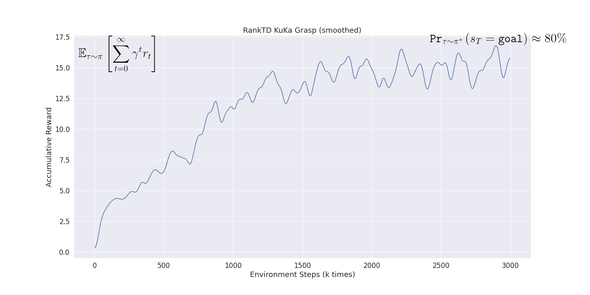

# Rank TD: End-to-End Robotic Reinforcement Learning without Reward Engineering and Demonstrations

 - [README_English](./readme_En.md) 
 - [README_Japanese](./readme_Jp.md)


Experiment
============
We designed a Pick and Place task with a robotic arm that grasp an object and puts it in a box.


Only two cameras (one on the upper right and one on the arm's shoulder) can be used to percept the world.


Robot should master this task with Trial and Error. 
Interestingly, unlike traditional reinforcement learning (RL) tasks, which require a complex reward function, 
nor Imitation Learning (IL) require a large number of Demonstrations (S, A). We just need to specify, as far as possible, a sequence of states the robot should go through to complete the task (defined by the internal state of the simulator). 
The agent will follow the trace we have designed.


In the training phase, we prepare 90 objects, with different shapes, sizes and colors
and we random the position of camera and robot base.

During the test phase, we prepare 10 objects, which never be seen in training phase.
and fixed position of camera and robot base.

We achieve 80% test success rate




During the test phase, the camera and the base coordinate system of the robot were fixed using 10 objects not seen in the training phase.


click here for [details](./doc/robomech_RM20-0006.pdf)


Supported systems
============

- Ubuntu 16.04 or Ubuntu 18.04.
- Python 3.6+

Installation
============

    git clone https://github.com/hyc6668378/RankTD_Kuka_Grasp.git
    cd RankTD_Kuka_Grasp
    
    # We recommended to run the demo in a virtual environment.
    
	pip3  install virtualenv
	virtualenv -p /usr/bin/python3.6 RankTD_PY36_env
	source RankTD_PY36_env/bin/activate
	
	pip install -r requirements.txt


Demo
============

We have trained a model, the calculation graph and weight is frozen in `'model/ rank_td.pd '`.

```shell
python demo.py
```


Training
============
The algorithm we adopt is PPO，with a multiprocess vectorized environments to improve roll-out efficiency。


If you want to train by yourself:

```shell
python train.py  
# Start from scratch? or start from an existing model?
# We recommend you check the contents of the file.
```

```shell
choose_best_model.py
# Evaluate the best of existing models, which have been trained
```


```shell
froze_model_to_pd.py
# When you're satisfied, fix the model to .pd file.
# yep, you have created smart robot.
```


Method
============
There are two difficulties in the robot reinforcement learning (imitation learning) :

1. Designing a reward function that not only reflects the task goal but is also carefully shaped to efficiently explore.
2. The other tricky issue is that current image-policy-based robot learning depends on demonstrations, which is a frequently-used method of Imitation Learning (IL).

An important reason for the combination of RL and IL is that IL significantly reduces the exploration space of agents by introducing prior knowledge. IL, however, also over-define the rules of the game and limit the creativity of the agent. This project aims to find a balance between the creativity of agents and the rigid rules of the game shaped by prior knowledge.


In order to let the agent explore follow the expert track, we leverage a skill called Rank Temporal-Difference (Rank TD):


 - Rank function is defined as a mapping  S->A.
 - We hope the agent learns a policy, when the trajectory generated under the policy, The rank of trajectory is also monotonically increasing.


 -  Unlike the definition of optimal policy pi* in classic RL, in this repo, the optimal policy in a goal-oriented reinforcement learning task is:


 -  We can still use almost every model-free reinforcement learning algorithm（except the Entropy-maximum RL algorithm）To solve this，just change the reward function to the Temporal-Difference of the Rank before two successive steps. However, if the agent encounters 1) non-successful termination condition and 2) the inverse order rank exceeds threshold, agent would get a -1 penalty and terminate the episode.


Citing Us
------------------
If you think this work is helpful to you. Welcome to cite our [`paper`](./doc/robomech_RM20-0006.pdf):

```
@article{RankTD,
    author = {ShengKai Huang},
    title = {Rank TD: End-to-End Robotic Reinforcement Learning without Reward Engineering and Demonstrations},
    year = {2020}
}
```
