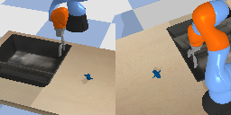

# Rank TD: End-to-End Robotic Reinforcement Learning without Reward Engineering and Demonstrations

 - [README_English](./readme_En.md) 
 - [README_Japanese](./readme_Jp.md)


実験設定
============

本研究の実験タスクは、ロボットが２つカメラにより外部環境を感知し、強化学習によりシミュレーター環境(Pybullet)の中に試行錯誤することで、不規則な物体を箱の中に入れるという実験タスクでございます


このシステムの入力は２つ枚RGB画像、出力はロボットアームのエンドエフェクタの変化値(dx,dy,xz)とグリパの回転角度と状態です。


図のように、ロボットが2つのカメラ（右上に1つ、腕の肩に1つ）をしか使わない、環境を感知します。


Robot should master this task with Trial and Error. Interestingly, unlike traditional reinforcement learning (RL) tasks, which require a complex reward function, nor Imitation Learning (IL) require a large number of Demonstrations (S, A). We just need to specify, as far as possible, a sequence of states the robot should go through to complete the task (defined by the internal state of the simulator). The agent will follow the trace we have designed.

ロボットが、試行錯誤することで、スキルを学習し、益々方策を賢くなれるようになりました。

面白いところは、従来のロボット強化学習（RL）タスクに比べて、複雑な報酬関数の設計は不要になります。

それだけでなく、見まね学習（IL）手法によく見られた教示データ（Demonstration）もいらない。

もしくは、「ロボティクス・メカトロニクス2020」に投稿した[論文](./doc/robomech_RM20-0006.pdf)を読みましょう。


システム環境
============

- Ubuntu 16.04 or Ubuntu 18.04.
- Python 3.6+

インストール
============

    git clone https://github.com/hyc6668378/RankTD_Kuka_Grasp.git
    cd RankTD_Kuka_Grasp
    
    # pipパッケージ衝突を避けるため、仮想環境の中に走るのはおすすめでございます。
    
	pip3  install virtualenv
	virtualenv -p /usr/bin/python3.6 RankTD_PY36_env
	source RankTD_PY36_env/bin/activate
	
	pip install -r requirements.txt


デモ
============
トレーニング済モデルの計算グラフと重みを`'model/ rank_td.pd '`に凍結しました。

```shell
python demo.py
```


トレーニング
============

我々が使ったアルゴリズムはPPOであり、ロールアウト効率を向上させるためにマルチプロセスベクトル化環境を備えています。

自分でトレーニング続いたい場合は：

```shell
python train.py  
# Start from scratch? or start from an existing model?
# We recommend you check the contents of the file.
```

```shell
choose_best_model.py
# Evaluate the best of existing models, which have been trained
```


```shell
froze_model_to_pd.py
# When you're satisfied, fix the model to .pd file.
# yep, you have created smart robot.
```


手法
============

ロボット強化学習（模倣学習）には2つの困難があります：


タスクの目標を反映するだけでなく、効率的に探索できるように慎重に形作られた報酬関数の設計。
1. 報酬関数の設計の際に、タスクの目標を反映するだけでなく、効率的に探索できるのも大切です。したがって、多くの場合、報酬関数はすごく複雑になってしまう。それは（Reward Engineering)といます。
2. もう1つの面倒臭いな問題は、現在の画像に基づいたロボット学習において、模倣学習（IL）の方法、あるいは(Demonstration)みたいな教師あり学習のデータセットをすごく依存している。

An important reason for the combination of RL and IL is that IL significantly reduces the exploration space of agents by introducing prior knowledge. IL, however, also over-define the rules of the game and limit the creativity of the agent. This project aims to find a balance between the creativity of agents and the rigid rules of the game shaped by prior knowledge.

RLとILを組み合わせる理由は、ILが事前知識を導入することでエージェントの探索空間を大幅に削減することができる。
ただし、ILはゲームのルールを過度に定義し、エージェントの創造性を制限するという問題点もあります。このプロジェクトの目的は、どうやってエージェントの創造性と事前知識によって形成された厳格なルールの間にバランスを取れようにの試みです。

In order to let the agent explore follow the expert track, we leverage a skill called Rank Temporal-Difference (Rank TD):


 - Rank function is defined as a mapping  S->A.
 - We hope the agent learns a policy, when the trajectory generated under the policy, The rank of trajectory is also monotonically increasing.


 -  Unlike the definition of optimal policy pi* in classic RL, in this repo, the optimal policy in a goal-oriented reinforcement learning task is:


 -  We can still use almost every model-free reinforcement learning algorithm（except the Entropy-maximum RL algorithm）To solve this，just change the reward function to the Temporal-Difference of the Rank before two successive steps. However, if the agent encounters 1) non-successful termination condition and 2) the inverse order rank exceeds threshold, agent would get a -1 penalty and terminate the episode.


Citing Us
------------------
If you think this work is helpful to you. Welcome to cite our [`paper`](./doc/robomech_RM20-0006.pdf):

```
@article{RankTD,
    author = {ShengKai Huang},
    title = {Rank TD: End-to-End Robotic Reinforcement Learning without Reward Engineering and Demonstrations},
    year = {2020}
}
```
